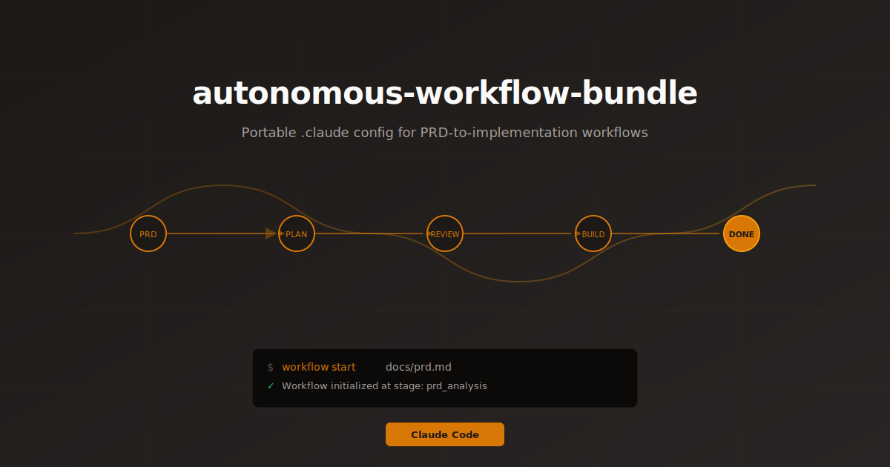
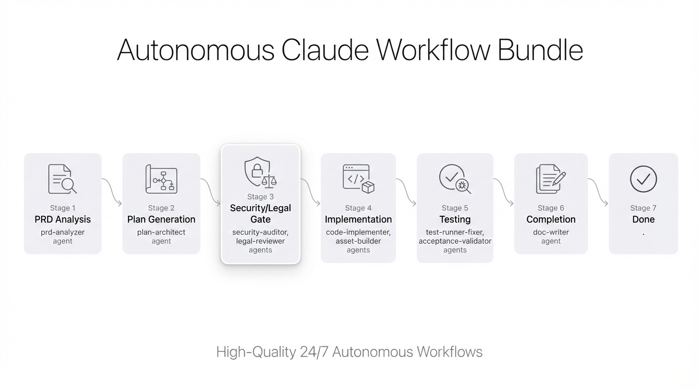

# Autonomous Claude Workflow Bundle

<p align="center">
  
</p>

<p align="center">
  <strong>High-quality, long-running autonomous workflows that run 24/7 until completion</strong>
</p>

<p align="center">
  
  
  
  
</p>

---

A complete `.claude` configuration bundle that transforms Claude Code into a **fully autonomous software development agent**. Drop it into any project to enable **continuous, unattended PRD-to-implementation workflows** that run around the clock with built-in security gates, quality checks, and multi-stage orchestration.

## Why Autonomous Claude Workflow Bundle?

- **🔄 True 24/7 Autonomy** - Start a workflow and let it run continuously until completion (or token limits). No manual intervention required.
- **🏗️ Production-Grade Quality** - Multi-stage validation with security audits, legal reviews, automated testing, and code quality gates at every step.
- **🛡️ Built-in Safety** - Automatic checkpointing, rollback capabilities, and file protection ensure safe, resumable execution.
- **📊 Long-Running Workflows** - Designed for complex, multi-day projects with persistent state management and progress tracking.
- **🎯 PRD-Driven Development** - Feed in requirements, get production-ready code with complete documentation and tests.

## Installation

```bash
# Clone the bundle
git clone https://github.com/YOUR_USERNAME/autonomous-workflow-bundle.git

# Copy to your project (rename to .claude)
cp -r autonomous-workflow-bundle/claude-bundle /path/to/your/project/.claude
```

## Setup

After installation, configure the bundle for your environment:

### 1. Environment Variables

The bundle includes environment variable support in `settings.json`. To set up your API keys:

Edit `.claude/settings.json` and replace placeholder values:

```json
{
  "env": {
    "GEMINI_API_KEY": "your_actual_gemini_api_key_here"
  }
}
```

### 2. Configure Permissions

Adjust `.claude/settings.local.json` to set permissions and MCP server preferences:

```bash
# Review and modify allowlists, MCP servers, and other local settings
nano .claude/settings.local.json
```

## Contents
- `claude-bundle/agents` — stage playbooks
- `claude-bundle/hooks` — routing/commands/validation/checkpoints
- `claude-bundle/skills` — project skills + bundled globals (`ios-simulator-skill`, `webapp-testing`, `frontend-design`, `web-artifacts-builder`, `gemini-imagegen`)
- `claude-bundle/settings.json` — hook wiring
- `claude-bundle/settings.local.json` — local permissions template
- `claude-bundle/workflow-state.json` — sanitized for a fresh start
- `claude-bundle/checkpoints/.gitkeep` — keeps the folder when zipped

## Workflow at a glance

<p align="center">
  
</p>

The workflow progresses through 7 stages with specific agents handling each phase:

| Stage | Agents | Purpose |
|-------|--------|---------|
| 1. PRD Analysis | `prd-analyzer` | Parse requirements and extract features |
| 2. Plan Generation | `plan-architect` | Create implementation plan and task graph |
| 3. Security/Legal Gate | `security-auditor`, `legal-reviewer` | Validate compliance (both must pass) |
| 4. Implementation | `code-implementer`, `asset-builder` | Execute development tasks |
| 5. Testing | `test-runner-fixer`, `acceptance-validator` | Verify functionality and requirements |
| 6. Completion | `doc-writer` | Generate documentation |
| 7. Done | — | Workflow complete |

## Prerequisites

### Required Claude Plugins

These plugins should be enabled in your Claude environment:
- `context7` - Documentation lookup
- `frontend-design` - UI development support
- `swift-lsp` - Swift language support (for iOS projects)
- `pyright-lsp` - Python language support
- `typescript-lsp` - TypeScript/JavaScript language support
- `ralph-wiggum` - Autonomous workflow loops
- `feature-dev` - Feature development assistance
- `code-review` - Code quality checks
- `security-guidance` - Security best practices

Enable with: `claude plugins enable <plugin>@claude-plugins-official`

### Optional MCP Servers

- `supabase` - Enabled by default in `settings.local.json`; disable if not needed

### System Requirements

- **Node.js & npm** - For code formatting and test hooks
- **Python 3.9+** - For workflow hooks and scripts
- **Xcode** (macOS only) - For iOS simulator workflows
- **Git** - For version control integration

### Environment Variables

| Variable | Required | Purpose | Default |
|----------|----------|---------|---------|
| `GEMINI_API_KEY` | Optional | Enable AI image generation with `gemini-imagegen` skill | - |
| `CLAUDE_PROJECT_DIR` | Optional | Override project directory location | Current directory |
| MCP server vars | Optional | Authentication for enabled MCP servers (e.g., Supabase) | - |

See the [Setup](#setup) section for configuration details.

### Skill Dependencies

| Skill | Requires | Purpose |
|-------|----------|---------|
| `workflow-orchestrator` | `context7` | Documentation lookup during workflow stages |
| `frontend-design` | `frontend-design` plugin | Production-grade UI development |
| `ios-simulator-skill` | Xcode, `swift-lsp` | iOS app testing and automation |
| `gemini-imagegen` | `GEMINI_API_KEY` | AI image generation and editing |
| `webapp-testing` | Node.js, Playwright | Web application testing |

## Usage
1. Copy `claude-bundle` to your project root as `.claude` (see Installation above).
2. Adjust `.claude/settings.local.json` for permissions/MCP servers as needed.
3. Start a workflow: `workflow start <path-to-prd>`. This initializes state at `prd_analysis`.
4. Check status: `workflow status`. Resume: `workflow resume`. Stage transitions occur on agent completions via `subagent-result-processor.py`.
5. Fully autonomous loop (optional): `/ralph-loop Start autonomous workflow with PRD at <path>` if you have the `ralph-wiggum` plugin enabled.

## Artifacts produced
During workflow execution, the following files are created in your project's `.claude/`:
- `requirements.json` — parsed PRD with features and acceptance criteria (after PRD Analysis)
- `implementation-plan.json` — task graph with file structure and dependencies (after Plan Generation)
- `workflow-state.json` — current stage, progress, and agent results (updated continuously)
- `checkpoints/` — session checkpoints for resuming interrupted workflows

## Notes
- No active workflow is included; state is reset.
- If plugins/MCP servers aren't available on the target machine, disable the entries in `settings.local.json`/`settings.json` and proceed without them.
- Security/legal gate: Stage 3 only advances after both `security-auditor` and `legal-reviewer` succeed.

## Troubleshooting

- **Command not found / missing plugin**: Enable it with `claude plugins enable <plugin>@claude-plugins-official`, or disable in `settings.local.json`.
- **Stuck stage**: Ensure the corresponding agent completed successfully; stage advances only on `subagent-result-processor.py` success.
- **Permissions prompt**: Tighten or relax `settings.local.json` allowlist as needed.

## Acknowledgments

Built for [Claude Code](https://claude.com/claude-code) by Anthropic.

Bundled skills include:
- `ios-simulator-skill` - iOS app testing and automation
- `webapp-testing` - Playwright-based web testing
- `frontend-design` - Production-grade UI development
- `web-artifacts-builder` - Complex artifact creation
- `gemini-imagegen` - AI image generation via Google Gemini

---
